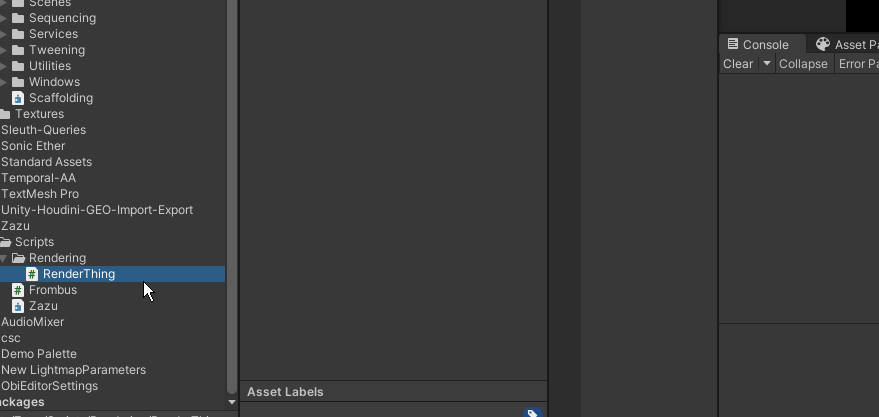
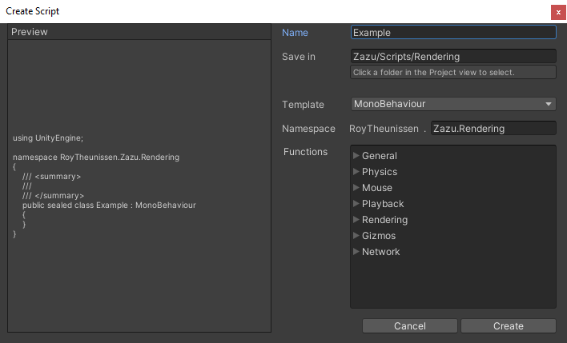

[](http://roytheunissen.com)
[](LICENSE.md)

<a href="https://roytheunissen.com" target="blank"><picture>
    <source media="(prefers-color-scheme: dark)" srcset="https://github.com/RoyTheunissen/RoyTheunissen/raw/master/globe_dark.png">
    <source media="(prefers-color-scheme: light)" srcset="https://github.com/RoyTheunissen/RoyTheunissen/raw/master/globe_light.png">
    
</picture></a>
<a href="https://bsky.app/profile/roytheunissen.com" target="blank"><picture>
    <source media="(prefers-color-scheme: dark)" srcset="https://github.com/RoyTheunissen/RoyTheunissen/raw/master/bluesky_dark.png">
    <source media="(prefers-color-scheme: light)" srcset="https://github.com/RoyTheunissen/RoyTheunissen/raw/master/bluesky_light.png">
    
</picture></a>
<a href="https://www.youtube.com/c/r_m_theunissen" target="blank"><picture>
    <source media="(prefers-color-scheme: dark)" srcset="https://github.com/RoyTheunissen/RoyTheunissen/raw/master/youtube_dark.png">
    <source media="(prefers-color-scheme: light)" srcset="https://github.com/RoyTheunissen/RoyTheunissen/raw/master/youtube_light.png">
    
</picture></a> 
<a href="https://www.tiktok.com/@roy_theunissen" target="blank"><picture>
    <source media="(prefers-color-scheme: dark)" srcset="https://github.com/RoyTheunissen/RoyTheunissen/raw/master/tiktok_dark.png">
    <source media="(prefers-color-scheme: light)" srcset="https://github.com/RoyTheunissen/RoyTheunissen/raw/master/tiktok_light.png">
    
</picture></a>

_Wizard that lets you create new script files with useful templates, automatic namespaces, and asmdef/asmref support._

## About the Project

Creating a new script is kind of a chore. Especially creating an editor script, and especially if you have asmdefs in your project.

You just want to make a simple custom inspector but now you have to:
- Create a new Editor folder next to the original script
- Create a new Editor script probably by duplicating an existing one (waiting for recompilation...) and then moving it (recompiling again...)
- Then you rename the file, rename the class and update the `[CustomEditor]` attribute above it.
- If you use asmdefs, you now also need to create a .asmref file that references the correct .asmdef.
  - Maybe there is no Editor.asmdef yet, so before all that  you have to make a new one.
  - Make a new folder again
  - Create a dummy script because .asmdef folders can't be empty
  - Then create a new .asmdef
  - THEN you can make your .asmref
  
TEDIOUS, I SAY

This is what all of that looks like with the Create Script Dialog. Just right-click, `Create>Script...` and press Create:



## Getting Started

- Right click a folder and select `Create>Script...` to open the dialog.
- Fill in the namespace if the automatic suggestion is not to your liking.
- Choose the appropriate template. It will automatically suggest an `Editor` or `PropertyDrawer` template if you right-clicked on an existing script.
- Press Create and the file, folder and any .asmdef shenanigans will be taken care of.



## Compatibility

Older Unity versions haven't been tested thoroughly, but this tool has been around for a while so it'll probably work fine in older versions.

## Installation

### Package Manager

Go to `Edit > Project Settings > Package Manager`. Under 'Scoped Registries' make sure there is an OpenUPM entry.

If you don't have one: click the `+` button and enter the following values:

- Name: `OpenUPM` <br />
- URL: `https://package.openupm.com` <br />

Then under 'Scope(s)' press the `+` button and add `com.roytheunissen`.

It should look something like this: <br />


<br />
All of my packages will now be available to you in the Package Manager in the 'My Registries' section and can be installed from there.
<br />


### Git Submodule

You can check out this repository as a submodule into your project's Assets folder. This is recommended if you intend to contribute to the repository yourself.

### OpenUPM
The package is available on the [openupm registry](https://openupm.com). It's recommended to install it via [openupm-cli](https://github.com/openupm/openupm-cli).

```
openupm add com.roytheunissen.createscriptdialog
```

### Manifest
You can also install via git URL by adding this entry in your **manifest.json** (make sure to end with a comma if you're adding this at the top)

```
"com.roytheunissen.assetpalette": "https://github.com/RoyTheunissen/Create-Script-Dialog.git"
```

### Unity Package Manager
From Window->Package Manager, click on the + sign and Add from git: 
```
https://github.com/RoyTheunissen/Create-Script-Dialog.git
```

## Acknowledgements

This tool was originally created by Unity themselves many years ago. I was not satisfied with its functionality so around 2014 I added namespace support.

The original tool has officially become deprecated but I have been using it all this time and gradually expanding it and improving it, and I've been getting a lot of value out of it over the years. I hope you will too.

## Contact
[Roy Theunissen](https://roytheunissen.com)

[roy.theunissen@live.nl](mailto:roy.theunissen@live.nl)
